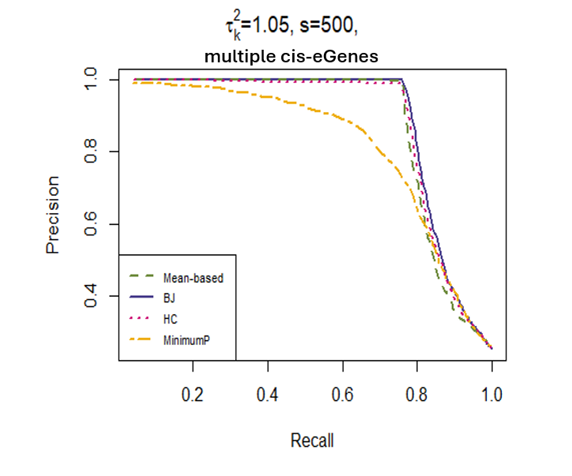

# eGene

Samhita Pal and Xinge Jessie Jeng

This contains the R codes for siumulation and real data analysis for our project 'Discovering Candidate Genes Regulated by GWAS Signals in Cis and Trans'. This study introduces a novel approach to discover candidate genes regulated by GWAS signals in both cis and trans. We utilize adaptive statistical metrics (like Berk Jones test statistic and the Higher Criticism test statistic) that can reflect both the strong, sparse effects of cis-eQTLs and the weak, dense effects of trans-eQTLs, thereby helping us uncover joint effects that include functional impact of GWAS loci residing in non-coding regions. 

### **Example: Evaluating Statistical Methods for SNP-Gene Relationships**

#### **Goal**
The simulation framework demonstrates the evaluation of various statistical tests (e.g., Higher Criticism (HC), Berk-Jones (BJ), Mean-based, and Minimum-P-value) in identifying genes associated with specific SNPs. 

#### **Input Data**
1. **SNP Data**:
   - The simulation uses SNP genotype data (followng the structure of, for example, the `SNP_data_HapMap_ch21_n90.RData`) with 90 subjects and 2000 SNPs for analysis.

2. **Parameters**:
   - Number of genes (100).
   - Number of active SNPs per gene (20).
   - Signal strength for **strong cis-effects** ($A_s = 4.25$) and **weak trans-effects** ($A_w = 0.2$).
   - Variance of signals ($\sigma_s = \sigma_w = 1.05$).
   - Correlation structure of SNPs derived from the input genotype data.

3. **Statistical Tests**:
   - Four statistical measures are computed for each gene: 
     - **Berk-Jones (BJ)** 
     - **Higher Criticism (HC)** 
     - **Mean-based**
     - **Minimum p-value**

#### **Methodology**
1. **Simulate Gene-SNP Effects**:
   - Strong cis-effects are generated for two SNPs near each gene.
   - Weak trans-effects are simulated for additional sets of SNPs (500 SNPs per set).
   - Noise is added to the SNP effects for non-active SNPs.

2. **Calculate Test Statistics**:
   - Compute $z$-scores for each SNP across genes, accounting for the correlation structure among SNPs.
   - Calculate the p-values and statistical measures for each gene using the `SetTest` package.

3. **Rank Genes by Statistical Test**:
   - Each gene is ranked by the statistical measure (e.g., BJ, HC).
   - Genes containing active SNPs are expected to rank higher.

4. **Evaluate Performance**:
   - Compare the methods using **precision-recall (PR) curves** to assess how well each method identifies candidate genes.

#### **Output**
1. **Precision-Recall Curves**:
   - The PR curves visualize the trade-off between precision and recall for each method across all iterations of the simulation.
   - Example plot: 
     - **BJ** (Berk-Jones) and **HC** (Higher Criticism) methods tend to outperform the Mean-based and Minimum-p-value methods when signals are sparse.
   - Example visualization:

    

2. **Summary Metrics**:
   - Mean precision and recall values across iterations for each statistical method.

#### **Code to Run the Example**
Here’s an example snippet to simulate SNP-gene associations and generate the PR curve:
```R
# Load SNP genotype data
load("SNP_gene.RData")

# Run the simulation code provided
source("simulation1.R")

# 'pval' refers to the eQTL p-values
min.pvalue    <- foreach(i = 1:iters) %dopar% {apply(pval[[i]],2,min)}

bj.stat       <- foreach(i = (1:iters)) %dopar% {
  sapply(1:num_of_genes, function(k) {
    SetTest::stat.bj(p=sort(pval[[i]][,k]),k0 = 1, k1 = 1000)$value })}

hc.stat        <- foreach(i = (1:iters)) %dopar% {
  sapply(1:num_of_genes, function(k) {
    SetTest::stat.hc(p=pval[[i]][,k],k0 = 2, k1 = 1000)$value })}

mean.stat     <- foreach(i = 1:iters) %dopar% {
  apply(abs(summary_stat[[i]]),2,mean)}

# Visualize Precision-Recall Curves
plot(BJ_mean_recall, BJ_mean_prec, 
     type = "l", col = "darkslateblue", ylab = "Precision", 
     xlab = "Recall", lwd = 2, main = "Precision-Recall Analysis")
lines(mean_mean_recall, mean_mean_prec, type = "l", col = "darkolivegreen4", lwd = 2, lty = 2)
lines(min_mean_recall, min_mean_prec, type = "l", col = "darkgoldenrod2", lwd = 2, lty = 6)
lines(HC_mean_recall, HC_mean_prec, type = "l", col = "deeppink3", lwd = 2, lty = 3)

legend("bottomleft", 
       legend = c("Mean-based", "BJ", "HC", "MinimumP"), 
       col = c("darkolivegreen4", "darkslateblue", "deeppink3", "darkgoldenrod2"),
       lty = c(2, 1, 3, 6), lwd = 2, cex = 0.7, horiz = FALSE, xpd = NA)
```

#### **Key Insights**
- **Berk-Jones (BJ)** and **Higher Criticism (HC)** outperform other methods in terms of precision and recall when signals are sparse and weak.

#### **Real-World Relevance**
This framework can be applied to analyze real SNP-gene data to evaluate the relative performance of different statistical measures for detecting genes with both strong and weak signals in genomics.

---
### Reference

Pal, Samhita, and Xinge Jessie Jeng. "Discovering Candidate Genes Regulated by GWAS Signals in Cis and Trans." arXiv preprint arXiv:2409.02116 (2024).
